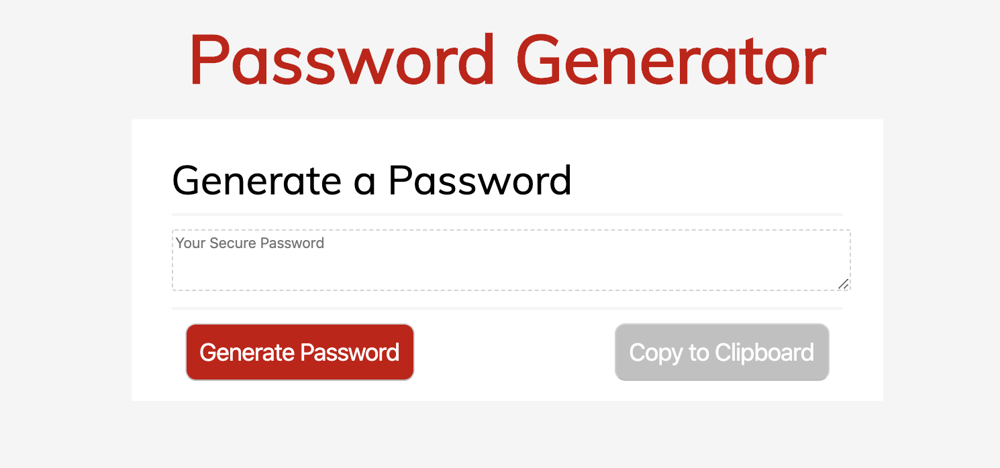

# Password-Generator
---
## Description
Running in the browser, and featuring HTML, CSS, and JavaScript, this application generates a random password based on user-selected criteria.

**Password criteria includes:**

    * password length (limited to 1-128 characters)
    * use of special characters
    * use of numeric characters 
    * use of lowercase characters 
    * use of uppercase characters 

**Buttons on the page:**

    1. **Generate:**

        * when clicked, starts a function that prompts the user to confirm character use in their password
        * using criteria input from user, random password is generated and displayed in textarea
        * background color of button becomes dark red when user hovers

    2. **Copy to Clipboard:**

        * when clicked, password in textarea is copied to user's clipboard
        * user is alerted that password has been copied
        * background color of button becomes dark gray when user hovers

## Display 

Active site : https://alicelouiserussell.github.io/Password-Generator/

